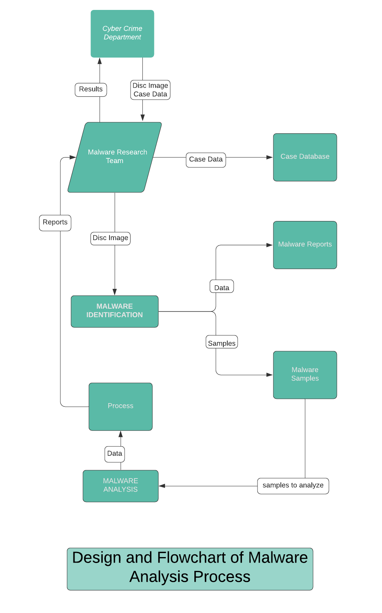
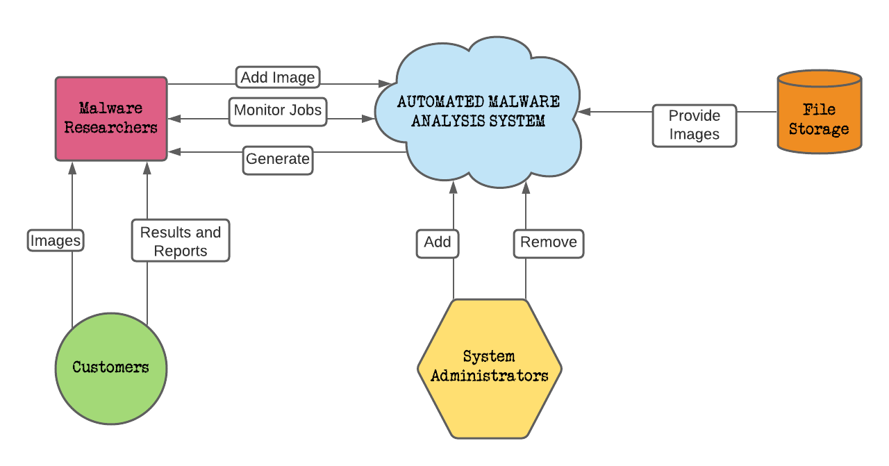
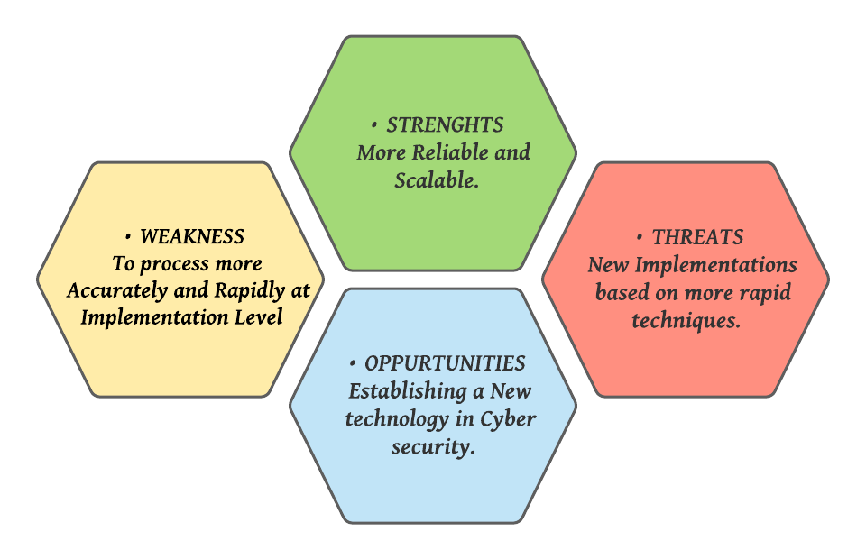

# Abstract
Hardware Trojans embedded in the modern Integrated Chips (ICs) is the most adverse threat due to its stealthy nature and rare triggering occurrence. In this work, we have proposed a novel triggering mechanism of an Hardware Trojan model in the Finite State Machine. In particular, this work illustrates the design and placement of sequential Hardware Trojans, which are rarely activated/ observed during basic testing of a chip. The proposed trojan model, theoretical analysis of effectiveness and simulation results are evaluated to determine the impact of this Trojan in a sequential circuit. It is shown that careful design and placement of the sequential Trojan can evade existing trojan detection approaches. We use the metric FiF-FoF (fan-in-factor and fan-out-factor) to characterise an FSM state with respect to its vulnerability to host a Hardware Trojan (HT). The FiF-FoF defines the mobility among the FSM states by estimating how frequently a state can be reached from other states as well as the frequency of exit from the state. The uniform mobility among the states points to less stealthy place for HT and, therefore, less vulnerable. The explored HT exploits the state codes that are hard-to-reach or hard-to-exit. The HTs can be hidden behind such states to evade the detection schemes. The analysis/experimentation establishes that such HTs are rarely activated and hard to detect. 

# Idea from the PROOF OF CONCEPT
## Requirement 
We are going to design an Automated Malware Analysis System by using the above Trojan Model. The Malware Research Team (MRT) operates as a plug-in step to the Cyber Crime Department(CCD) process of investigating a computer based crime. After collection of raw evidence from affected computers in the form of bit-for-bit copies or disk images, the investigator will search the computer for keywords or other specific evidence. If malware is suspected to have played a role in the crime, the investigator will obviously have an interest in finding out which malware exists on the computer and what the role of that malware is. 

## Defining the System
To aid with this, the MRT is given a brief description of the case and a copy of the disk image (inputs to the system), performs a malware analysis process, and returns a report to the Cyber Crime Department(CCD) to assist them with solving the case.
The MRT has an internal process that is used to examine cases in a predictable, sustainable, and repeatable manner. This process consists of two major phases, which correspond to the primary requirements from the CCD: Detection (what malware exists?), and behavior analysis (what does that malware do?)

A flow chart detailing the MRT’s interaction with CCD, processing of the case, and reporting of results is shown below

## Features
### RELIABILITY
Reliability is important to the Malware Research Team and its customers, because providing accurate information to Cyber Crime Department will help to ensure that is justice is served. 
Some of the problems addressed here are 
* Ability of system components to be validated.
* Reduce Labor-intensity of process.
* Privacy of case-related data.
* Integrity of reported results.
* Frequency and severity of human errors.

### SCALABILITY
Scalability is a far more important problem, because a more scalable system would allow a greater number of malware-related cases to be processed by the MRT, without the need for additional personnel with the expertise required for such investigation. Additionally, a system that can scale via hardware instead of via added labor will allow case completion time to become more predictable and consistent.

## Cost

## 4 W's and 1H
### WHO
The Cyber Crime Department(CCD) who have an interest in finding out which malware exists on the computer and what the role of that malware is, If malware is suspected to have played a role in any Cyber Crime.

### WHAT
We are going to design an Automated Malware Analysis System by using the above Trojan Model. The Malware Research Team (MRT) operates as a plug-in step to the Cyber Crime Department(CCD) process of investigating a computer based crime. A good way to look at the scope of work done by the MRT is to look at the malware analysis process first as a *Black Box*, and examine the inputs and outputs of the system before analyzing the process in detail.

### WHEN
During a Cyber attack, If malware is suspected to have played a role in the crime.

### WHERE 
It's a online submission-based website which will accept uploaded malware, execute this malware, but would run on local hardware in a secure and controlled environment using virtualization and Automation, and then return details about how the malware affected its environment while it executed, and then read and send the results afterwards.

### HOW
Two things need to be provided by the end-user who is utilizing the MRT:
* *Case description* – background information, official write-ups, suspected attack vectors, personnel interviews (if available).
* *Case materials* – image or other bit-for-bit copy of affected disk drives, or any other digital media needing analysis.
In return, the MRT provides the following:
* *Case report* – summary of findings (what malware, effects of malware) as well as detailed descriptions of each malware found.

## System Context Diagram

## SWOT Analysis

## High Level Requirements

## Low Level Requirements
